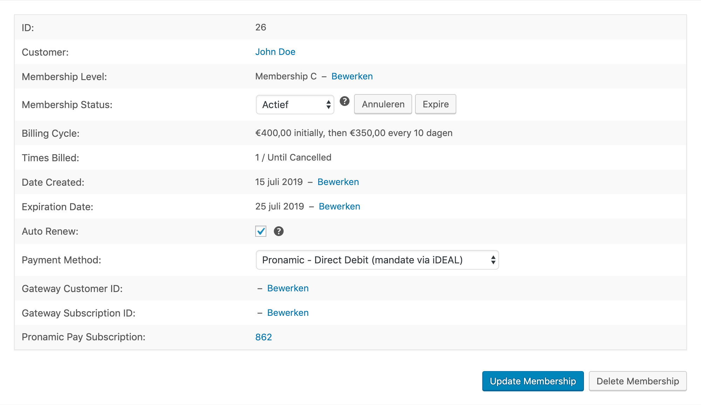

# WordPress Pay Extension: Restrict Content Pro

**Restrict Content Pro driver for the WordPress payment processing library.**

## Restrict Content Pro

https://gitlab.com/pronamic-plugins/restrict-content-pro

To download the latest version of Restrict Content Pro the plugin updater API can be used.
You have to replace `LICENSE` and `URL` in the following command. If you need a beta
release you can set `beta` to `1`.

```
curl --request POST https://restrictcontentpro.com/ \
    --data "edd_action=get_version&license=LICENSE&item_name=restrict-content-pro&item_id=479&version=1.0.0&slug=restrict-content-pro&author=Restrict Content Pro Team&url=URL&beta=0" \
    | jq '.package'
```

### Edit Membership

In Restrict Content Pro version 3 or higher it is possible to edit memberships.
Changes to a Restrict Content Pro membership can also influence the connected
Pronamic Pay subscription:



#### Edit "Membership Level"

When you change the "Membership Level" of a Restrict Content Pro membership the
connected Pronamic Pay subscription will be cancelled. If you click the 
Restrict Content Pro "Change Level" button you will see a confirmation modal
dialog with the following text:

> Are you sure you want to change the membership level? The subscription will be cancelled at the payment gateway and this customer will not be automatically billed again. 

If you confirm by selecting OK Restrict Content Pro will create a new membership.
The other Restrict Content Pro membership will be marked as `disabled`. The new
Restrict Content Pro membership will not be connected to a Pronamic Pay subscription.

#### Edit "Membership Status"

When you change the "Membership Status" of a Restrict Content Pro membership the
connected Pronamic Pay subscription will be updated accordingly.

| Restrict Content Pro status | Pronamic Pay subscription status |
| --------------------------- | -------------------------------- |
| Active                      | Active                           |
| Expired                     | Expired                          |
| Cancelled                   | Cancelled                        |
| Pending                     | Pending                          |

#### Edit "Date Created"

Editing the Restrict Content Pro membership "Date Created" value will not affect
the connected Pronamic Pay subscription. The Pronamic Pay subscription date will
not be updated.

#### Edit "Expiration Date"

Editing the Restrict Content Pro membership "Expiration Date" value will not affect
the connected Pronamic Pay subscription. The Pronamic Pay subscription expiration
date will not be updated. We are not updating this due to the following
Restrict Content Pro notice:

> Changing the expiration date will not affect when renewal payments are processed.


#### Edit "Auto Renew"

Editing the Restrict Content Pro membership "Auto Renew" value will not affect
the connected Pronamic Pay subscription. The Pronamic Pay subscription will not
be cancelled. We are not doing this due to the following Restrict Content Pro notice:

> Changing the recurring indicator will not set up or remove a subscription with the gateway. This checkbox is for updating RCP records only.


### Gateway supports

Foreach Restrict Content Pro gateway it is possible to define which features are supported.
In Restrict Content Pro version 3 the following supports values are available:

| Support     | Description        |
| ----------- | ------------------ |
| `one-time`  | one time payments  |
| `recurring` | recurring payments |
| `fees`      | fees               |
| `trial`     | free trials        |

Source: https://docs.restrictcontentpro.com/article/1695-payment-gateway-api

In the Pronamic Pay extension we try to set the supports values as correct as possible
for the different gateways. Restrict Content Pro however will not hide/show gateways 
based on the supports values.

Restrict Content Pro membership levels with a recurring can be paid with a
one-time payment gateway like iDEAL. And unlimited membership levels can 
be paid with a recurring payment gateway like Direct Debit (mandate via iDEAL).

Once a user pays a recurring membership level with a one-time payment gateway, 
it will not be automatically renewed. Restrict Content Pro is not very clear 
about this, so make sure you inform your users about this!

## Test

*	Not logged in new membership.
*	Logged in new membership.
*	Logged in upgrade membership.
*	Cancel membership.
*	Discount code.
*	Lifetime membership.
*	Free trial.
*	Fee.
*	Free member.
*	Billing Cycle:	€7.00 initially, then €3.00 every day.

## WP-CLI

### What is WP-CLI?

For those who have never heard before WP-CLI, here's a brief description extracted from the [official website](https://wp-cli.org/).

> **WP-CLI** is a set of command-line tools for managing WordPress installations. You can update plugins, set up multisite installs and much more, without using a web browser.

### Commands

```bash
$ wp pronamic-pay restrict-content-pro
usage: wp pronamic-pay restrict-content-pro upgrade-216 <command>

See 'wp help pronamic-pay restrict-content-pro <command>' for more information on a specific command.
```

### Command `pronamic-pay restrict-content-pro upgrade-216 execute`

Execute 2.1.6 upgrade.

```bash
$ wp pronamic-pay restrict-content-pro upgrade-216 execute
```

### Command `pronamic-pay restrict-content-pro upgrade-216 list-payments`

List payments for 2.1.6 upgrade.

```bash
$ wp pronamic-pay restrict-content-pro upgrade-216 list-payments
```

### Command `pronamic-pay restrict-content-pro upgrade-216 list-subscriptions`

List subscriptions for 2.1.6 upgrade.

```bash
$ wp pronamic-pay restrict-content-pro upgrade-216 list-subscriptions
```

### Command `pronamic-pay restrict-content-pro upgrade-216 upgrade-subscriptions`

Upgrade subscriptions for 2.1.6.

```bash
$ wp pronamic-pay restrict-content-pro upgrade-216 upgrade-subscriptions
```

```bash
$ wp pronamic-pay restrict-content-pro upgrade-216 upgrade-subscriptions --skip-no-match=true --reactivate=true --dry-run=false
```

## Links

- [Restrict Content Pro](https://restrictcontentpro.com/)
- [GitHub Restrict Content Pro](https://github.com/restrictcontentpro/restrict-content-pro)
- https://github.com/stellarwp/restrict-content/
